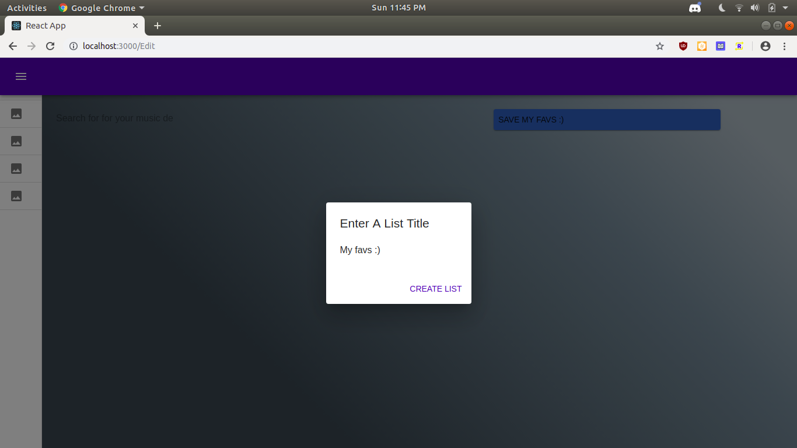
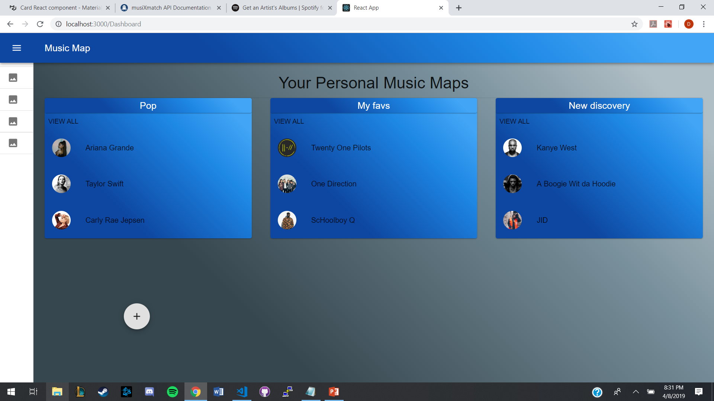
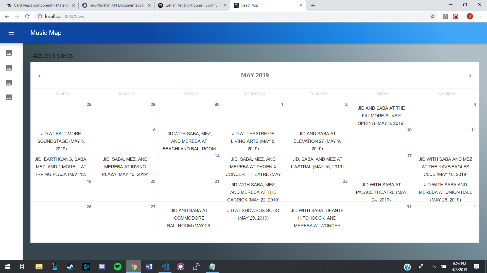

# Music Map

## Music Map is a web application under development with the intention of allowing users to keep up with the tour dates of their favorite artists.

### Use the power of Spotify's API to search for artists and create polished lists!

### Use the power of Songkick's API to find all upcoming tour dates!

# Preview

First create one or many list to categorize your favorite artists.

View your created list from the dashboard home!

Load an interactive calendar of upcoming concert dates of all artists from one of your lists!

Each Event cotains a link to the Songkick Event page with more details and an option to purchase tickets!

# Development

Current development can be found on the "<a href="https://github.com/alxford45/oop-project/tree/refactor">refactor</a>" branch

## Motivation

This project was developed as an assignment for the class CS3380: Object Oriented Programming at Louisiana State University. All commits after May 2019 were done outside the assignment submission.

## Disclaimer

This project is currently unlicensed. The project is currently not deployed and the authors currently have no intention of monetization. It is the future intention of the authors for this project to be re-licensed with an appropriate open-source license.

## Technology

Music Map's anatomy is made up of the Web and Server directories.

### Web

The frontend is written using Typescript and React. Additionaly Apollo Client is used to mediate between GraphQL and React to handle all internal and external API calls. Styling is done in-line using Material-UI.

### Server

The backend is written using Typescript in the Node environment. The server is created by Apollo Server using Express as middle-ware. Express is used to take advantage of Express sessions to handle user authentication with cookies. APIs are handled using GraphQL's query/mutation and typeDef/resolver model as opposed to the traditional REST model. User data is stored in a PostgreSQL database. API calls to the database are normalized using TypeORM.

### Tooling

Notable tooling used during development were nodemon, create-react-app, and the tooling provided by typescript's compiler.

## Acknowledgements

This project's architecture was heavily influenced by Ben Awad's repo: "<a href="https://github.com/benawad/graphql-typescript-stripe-example">graphql-typescript-stripe-example</a>".
Ben makes great and informative <a href="https://www.youtube.com/user/99baddawg">youtube videos</a> and has excellent project examples on his <a href="https://github.com/benawad">github</a>.
